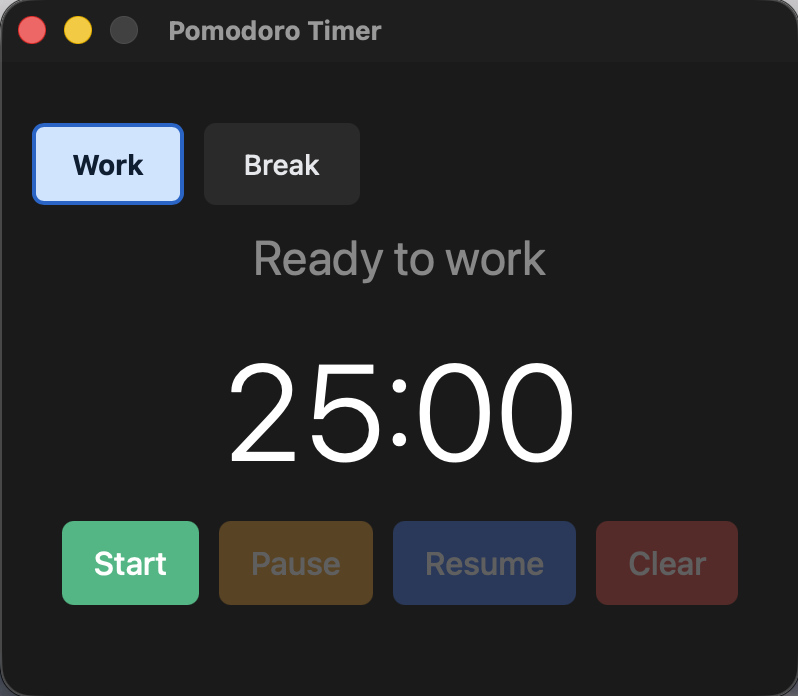

# pomodoro timer

A simple desktop app for the Pomodoro Technique: 25 minutes of focused work followed by 5 minutes of break.



## Setup

Install dependencies for front-end:

```console
npm install
```

## Usage

Run the app in development mode:

```console
cd src-tauri && cargo tauri dev
```

Run tests:

```console
cd src-tauri && cargo test
```

Format code:

```console
cd src-tauri && cargo fmt
```

## Development

Use [spec-kit](https://github.com/github/spec-kit).

In this project, AI writes all code. What human does is writing spec and manage AI behavior.
