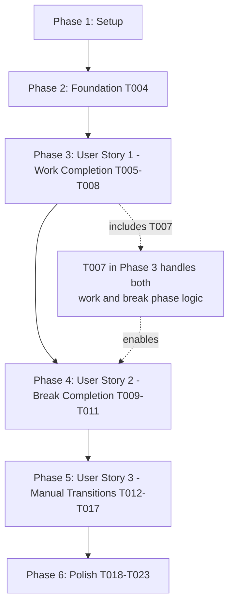

# Tasks: Stay on Completed Session

**Input**: Design documents from `/specs/008-stay-on-complete/`
**Prerequisites**: plan.md, spec.md, research.md, data-model.md, quickstart.md

**Tests**: Unit tests are included in this implementation

**Organization**: Tasks are grouped by user story to enable independent implementation and testing of each story.

## Format: `- [ ] [ID] [P?] [Story] Description`

- **[P]**: Can run in parallel (different files, no dependencies)
- **[Story]**: Which user story this task belongs to (e.g., US1, US2, US3)
- Include exact file paths in descriptions

## Path Conventions

This is a single project with Rust backend:

- Backend: `src-tauri/src/`
- Tests: `src-tauri/src/timer/tests.rs`

---

## Phase 1: Setup (Shared Infrastructure)

**Purpose**: Verify existing infrastructure is ready

- [X] T001 [P] Verify current timer.rs implementation has required methods: handle_completion(), start(), clear(), set_phase()
- [X] T002 [P] Verify Status::Complete enum value exists in src-tauri/src/timer.rs
- [X] T003 [P] Verify test infrastructure is working by running existing tests with `cargo test`

---

## Phase 2: Foundational (Blocking Prerequisites)

**Purpose**: Core modifications that all user stories depend on

**⚠️ CRITICAL**: No user story work can begin until handle_completion() is modified

- [X] T004 Modify handle_completion() method in src-tauri/src/timer.rs to stay in current phase instead of auto-switching

**Checkpoint**: handle_completion() modified - user story implementation can now begin

---

## Phase 3: User Story 1 - Stay in Work Session After Completion (Priority: P1) 🎯 MVP

**Goal**: When a work session completes, timer stays in work mode at 00:00 without auto-switching to break

**Independent Test**: Run a work session to completion and verify it stays in work mode showing 00:00, Work button emphasized, no automatic break session

### Tests for User Story 1

> **NOTE: Write these tests FIRST, ensure they FAIL before further implementation**

- [X] T005 [P] [US1] Add test_work_completion_stays_in_work_mode in src-tauri/src/timer/tests.rs
- [X] T006 [P] [US1] Add test_start_after_work_completion_restarts_work in src-tauri/src/timer/tests.rs

### Implementation for User Story 1 & 2

- [X] T007 [US1+US2] Modify start() method in src-tauri/src/timer.rs to handle Status::Complete with phase-aware restart for both work and break phases
- [X] T008 [US1] Run cargo test to verify work completion tests pass

**Checkpoint**: At this point, work session completion behavior is fully functional and independently testable

---

## Phase 4: User Story 2 - Stay in Break Session After Completion (Priority: P2)

**Goal**: When a break session completes, timer stays in break mode at 00:00 without auto-switching to work

**Independent Test**: Run a break session to completion and verify it stays in break mode showing 00:00, Break button emphasized, no automatic work session

### Tests for User Story 2

- [X] T009 [P] [US2] Add test_break_completion_stays_in_break_mode in src-tauri/src/timer/tests.rs
- [X] T010 [P] [US2] Add test_start_after_break_completion_restarts_break in src-tauri/src/timer/tests.rs

### Implementation for User Story 2

- [X] T011 [US2] Run cargo test to verify break completion tests pass

**Checkpoint**: At this point, break session completion behavior is fully functional and independently testable

---

## Phase 5: User Story 3 - Manual Session Transition After Completion (Priority: P3)

**Goal**: Users can manually switch between work and break sessions after completion using Work/Break buttons

**Independent Test**: Complete any session, click opposite session button, verify it switches to that session's standard duration

### Tests for User Story 3

- [X] T012 [P] [US3] Add test_phase_switch_from_complete_status in src-tauri/src/timer/tests.rs
- [X] T013 [P] [US3] Add test_same_phase_switch_after_complete_resets in src-tauri/src/timer/tests.rs
- [X] T014 [P] [US3] Add test_clear_preserves_current_phase in src-tauri/src/timer/tests.rs

### Implementation for User Story 3

- [X] T015 [US3] Modify clear() method in src-tauri/src/timer.rs to preserve current phase when resetting
- [X] T016 [US3] Modify set_phase() method in src-tauri/src/timer.rs to handle Status::Complete transitions
- [X] T017 [US3] Run cargo test to verify all manual transition tests pass

**Checkpoint**: At this point, manual session control after completion is fully functional and independently testable

---

## Phase 6: Polish & Cross-Cutting Concerns

**Purpose**: Final verification and edge case handling

- [X] T018 Run full test suite with cargo test to verify all 7 new tests plus existing tests pass
- [X] T019 Run cargo tauri dev and perform manual testing per quickstart.md verification checklist
- [X] T020 [P] Verify completion indication (visual/audible) still triggers at 00:00
- [X] T021 [P] Test edge case: pause at 00:01, resume to 00:00, verify stays in current phase
- [X] T022 [P] Run cargo fmt to format code according to project standards
- [X] T023 [P] Run cargo clippy to check for Rust best practices violations

---

## Dependencies Between User Stories

**Parallel Opportunities**:

- Phase 1 tasks T001-T003 can run in parallel (verification tasks)
- Phase 3: Tests T005 and T006 can be written in parallel
- Phase 4: Tests T009 and T010 can be written in parallel (but implementation depends on T007 completion)
- Phase 5: Tests T012, T013, T014 can be written in parallel
- Phase 6: Tasks T020-T023 can run in parallel after T018-T019 complete

---

## Implementation Strategy

**MVP First (Phase 3 only)**:

- Implement just User Story 1 (work completion stays in work mode)
- This provides immediate value and can be deployed independently
- Users get manual control over work-to-break transitions

**Incremental Delivery**:

1. **Day 1**: MVP (US1) - Work completion behavior
2. **Day 1**: US2 - Break completion behavior (mirrors US1)
3. **Day 2**: US3 - Manual transitions and edge cases
4. **Day 2**: Polish and full integration testing

---

## Task Summary

**Total Tasks**: 23 (reduced from 24 by combining T007 and old T011 into single task)

- Phase 1 (Setup): 3 tasks
- Phase 2 (Foundation): 1 task
- Phase 3 (US1 - Work Completion): 4 tasks (includes T007 which handles both US1+US2)
- Phase 4 (US2 - Break Completion): 3 tasks
- Phase 5 (US3 - Manual Transitions): 6 tasks
- Phase 6 (Polish): 6 tasks

**Test Tasks**: 7 unit tests (T005, T006, T009, T010, T012, T013, T014)
**Implementation Tasks**: 4 method modifications (T004 handle_completion, T007 start combined, T015 clear, T016 set_phase)

**Parallel Opportunities**: 14 tasks can run in parallel (marked with [P])

**Estimated Effort**:

- Phase 1-2: 1-2 hours (setup and foundation)
- Phase 3: 2-3 hours (MVP - work completion)
- Phase 4: 1-2 hours (break completion - similar to US1)
- Phase 5: 2-3 hours (manual transitions and edge cases)
- Phase 6: 1-2 hours (polish and verification)
- **Total**: 7-12 hours

---

## Format Validation

✅ All tasks follow checklist format: `- [ ] [ID] [P?] [Story?] Description with file path`
✅ Tasks organized by user story for independent implementation
✅ Each phase has clear goal and checkpoint
✅ Independent test criteria defined for each user story
✅ Dependencies clearly documented
✅ Parallel execution opportunities identified
